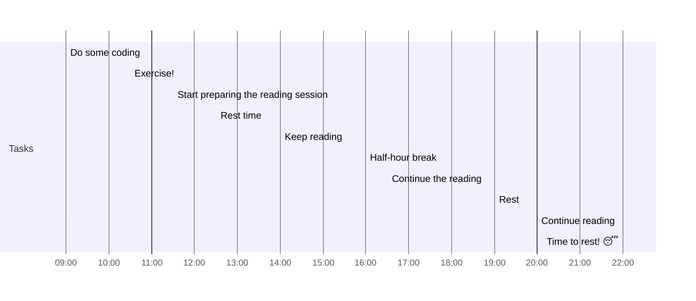

## Day Planner


- [x] 09:00 Do some coding
- [x] 10:30 Exercise!
- [x] 11:30 Start preparing the reading session
- [x] 12:30 Rest time
- [x] 14:00 Keep reading
- [x] 16:00 Half-hour break
- [x] 16:30 Continue the reading
- [x] 19:00 Rest
- [ ] 20:00 Continue reading
- [ ] 22:00 Time to rest! 😴

## Associated tasks for today 
```tasks
path includes ProyectoInt
```