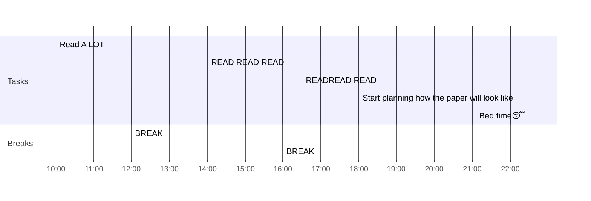

## Day Planner

- [x] 10:00 Read  A LOT
- [x] 12:00 BREAK
- [x] 14:00 READ READ READ
- [x] 16:00 BREAK
- [x] 16:30 READREAD READ
- [ ] 18:00 Start planning how the paper will look like
- [ ] 22:30 Bed time😴